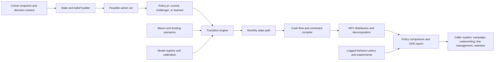

# Credit-Card NPV as an MDP/POMDP: Design Proposal for Policy Simulation and Future Reinforcement Learning

Date: 2026-07-02

Scope: This note proposes a holistic sequential-decision layer for the credit-card NPV component. It is not a proposal to build the bank's entire decision platform. The component should remain a valuation and policy-simulation service that plugs into acquisition, underwriting, line-management, retention, and account-management systems.

## 1. Executive Recommendation

Yes. The credit-card NPV component should be designed as a finite-horizon Markov decision process, with a partially observable state layer where needed. In practice, this means:

1. Define a customer/account state, a feasible action set, a transition model, a reward/cash-flow model, constraints, and a policy interface.
2. Use the current NPV path engine and cash-flow compiler as the transition-and-reward machinery inside this MDP/POMDP layer.
3. First use the layer for forward simulation and policy evaluation: "given this policy, cohort, scenario, and valuation convention, what distribution of NPV and constraints do we expect?"
4. Treat reinforcement learning as a later controlled research and optimization path, not as the first production use. Offline RL can fail badly when historical data lack support for the proposed policy; the literature is explicit about distribution shift, extrapolation error, and the need for off-policy evaluation.

This design fixes a real gap in the current proposal. The existing document has modules for spend, balances, losses, attrition, funding, capital, and cash-flow compilation, but it does not yet specify one holistic sequential object that connects decisions today to future states, future feasible actions, and future cash flows. Without that object, we can forecast pieces of NPV, but we cannot rigorously simulate a downstream policy, evaluate an alternative account-management regime, or apply RL-style optimization.

The immediate deliverable should therefore be an MDP/POMDP specification and simulator interface inside the NPV component. The later RL deliverable should be gated by data support, off-policy evaluation, randomized experimentation, constraints, model-risk review, and business/legal feasibility.

## 2. Literature Basis and What It Supports

The relevant literature supports a staged conclusion, not a leap to autonomous RL.

Sutton and Barto's reinforcement-learning text gives the formal vocabulary: a policy maps states to actions; a reward signal defines the objective; a value function represents long-run reward; and an optional environment model supports planning. This directly justifies describing the NPV component as a state/action/reward/value system when actions affect future spend, balances, losses, attrition, and later account-management opportunities.

Kaelbling, Littman, and Cassandra's POMDP treatment is important because a credit-card issuer does not observe the true customer wallet state. We observe our own card, deposits, application data, bureau snapshots, transactions, and campaign history; we do not fully observe competitor-card usage, total wallet, future income shocks, or the customer's latent preferences. Their POMDP construction supports using a belief state, not just the raw observation vector, as the decision state.

Dynamic-treatment-regime work, including Schulte et al. and Laber et al., gives a statistical causal frame for sequential decisions from observational or randomized data. It is directly relevant because credit-card actions are not one-shot treatments: marketing, approval, line assignment, promotional terms, line changes, retention, hardship, and collections decisions all affect later states and later decisions. This literature also warns that sequential randomization, consistency, and positivity/support are not optional details; without them, a learned "optimal" policy may be a biased artifact of historical selection.

The offline-RL literature is a warning label for bank use cases. Levine et al. describe offline RL as learning from a static dataset collected by a behavior policy, with no new environment interaction during training. They emphasize counterfactual queries and distribution shift. Fujimoto et al. show that standard off-policy deep RL can fail in fixed-batch settings because of extrapolation error on unseen state-action pairs. Kumar et al. propose conservative Q-learning to lower-bound value estimates under offline distribution shift. These papers support conservative, support-aware policy improvement, not free extrapolation outside logged bank behavior.

Off-policy evaluation papers by Dudik et al., Jiang and Li, and Thomas and Brunskill support a policy-evaluation layer before any RL deployment. They distinguish direct model-based estimates, importance-sampling estimates, doubly robust estimates, and weighted/blended estimators. Their message for this project is practical: a proposed NPV policy should be evaluated against historical logged behavior and simulator estimates, with uncertainty and support diagnostics, before it is used for real decisions.

Achiam et al.'s constrained-policy-optimization paper and the constrained-MDP framework are useful because credit-card NPV is not a scalar-profit-only problem. A policy may increase expected NPV while violating loss, capital, fairness, compliance, liquidity, complaint, or operational constraints. These quantities should be modeled as explicit constraint costs, not hidden inside a single reward number.

Finally, Alfonso and Sanchez provide a direct credit-card example: they formulate credit-limit management as an MDP, use actions such as maintaining or increasing the line, and define reward as expected short-horizon profit net of provisions. This is not a proof that the same method is production-ready for a large US retail bank, but it demonstrates that the MDP formulation is natural for credit-card account management. Tkachenko gives a CRM/CLV example where customer state, marketing actions, reward, and value are interpreted as customer lifetime value; again, useful as a design analogy rather than a production guarantee.

There is also a particularly relevant industry precedent that should be retrieved through library or licensed access before the main proposal is finalized. Crossref metadata for Trench et al., "Managing Credit Lines and Prices for Bank One Credit Cards," reports an INFORMS Interfaces paper about PORTICO, a Bank One system using Markov decision processes to select APRs and credit lines with an NPV objective. Because the publisher PDF was not accessible in this environment, this note treats the paper as high-priority source-blocked evidence rather than as inspected technical support.

## 3. The Formal Object We Need

The NPV component should expose a finite-horizon controlled stochastic process. Monthly time is the natural first grid because many card states, delinquencies, statements, payments, vintages, and finance ledgers are monthly. Some subdecisions, such as campaign contact or authorization, may occur at finer frequency, but the valuation simulator can aggregate them into monthly state transitions unless the business decision requires finer resolution.

Let:

```text
i        customer or account index
t        monthly decision time
H        valuation horizon, e.g. 60 or 84 months
X_it     latent true state
O_it     observed state available to the bank
H_it     history: observations, actions, rewards, assignments through t
b_it     belief state, b_it(x) = P(X_it = x | H_it)
d_it     decision context, e.g. acquisition, approval, line assignment, retention
a_it     action selected from the feasible action set A_t(b_it, d_it)
M_t      macro, market, and local-labor scenario state
r_it     economic reward/cash-flow primitive
c_it     vector of constraint costs
pi       policy mapping state/belief and context to actions
```

The controlled process is:

```text
a_it ~ pi(. | b_it, d_it, M_t)
X_i,t+1 ~ P_theta(. | X_it, a_it, M_t, pi_downstream)
O_i,t+1 ~ G_phi(. | X_i,t+1)
b_i,t+1 = Update(b_it, a_it, O_i,t+1)
r_it = R_psi(X_it, O_it, a_it, X_i,t+1, M_t)
c_it = C_eta(X_it, O_it, a_it, X_i,t+1, M_t)
```

The policy value is:

```text
V^pi(b_i0, s) =
  E_pi [ sum_{t=0}^{H-1} beta^t r_it + beta^H TV_iH
         | b_i0, scenario s, valuation convention v ]
```

The object used for business decisions should usually be incremental value relative to a baseline policy:

```text
Delta V^pi = V^pi - V^pi0
```

where `pi0` is the current or otherwise declared baseline policy. Common random numbers should be used in simulation so that differences between policies are not dominated by Monte Carlo noise.

For constrained decisioning, the optimization problem should be:

```text
maximize_pi    E[Delta V^pi]
subject to     E[sum beta^t c_loss,t]       <= loss_budget
               E[sum beta^t c_capital,t]    <= capital_budget
               E[sum beta^t c_liquidity,t]  <= liquidity_budget
               fairness/compliance gates    satisfied by design and audit
               action feasibility           a_t in A_t(b_t, d_t)
```

The scalar reward is therefore not enough. The simulator must return both the value decomposition and the constraint-cost decomposition.

## 4. Why a POMDP Rather Than Only an MDP

The bank observes a rich customer record, but not the complete economic state. The following are partially observed or latent:

- competitor-card wallet share;
- true total revolving debt and payment priority across issuers between bureau snapshots;
- income, employment risk, and household liquidity shocks;
- customer preference for rewards, APR, convenience, digital wallet, branch relationship, or product bundle;
- future response to marketing fatigue or servicing friction;
- latent fraud, dispute, complaint, and reputational risk;
- intended use of a new card: primary card, backup card, balance-transfer vehicle, one-time promotion, or dormant account.

A pure observed-state MDP can still be implemented, but it risks pretending the observation vector is the true state. The better design is to treat the operational state as a belief state:

```text
b_t = P(latent wallet, liquidity, preference, risk, outside balances | observed history)
```

This does not require an exotic black-box belief model at launch. A first implementation can use transparent state estimates:

- posterior probability of primary-card adoption;
- estimated total card wallet and share of wallet;
- probability of promotional-only behavior;
- latent transactor/revolver/payment-stress segment;
- expected outside debt and liquidity stress;
- probability of attrition, dormancy, or reactivation.

The POMDP literature supports this exact architectural move: maintain a belief state from actions and observations, then let the policy act on the belief. For engineering simplicity, the NPV component can expose the belief state as the "MDP state" used by downstream callers.

## 5. State Design for Credit-Card NPV

The state is the contract between the forecasting modules and the decision layer. It must include variables needed to predict future rewards and future feasible actions, but it must not include post-decision information that would leak future outcomes into today's decision.

### 5.1 Customer and Relationship State

Static and slowly moving customer attributes:

- origination channel, acquisition campaign, prospect source, application channel;
- geography, local labor market, and macro exposure;
- internal relationship tenure, deposit relationship, digital engagement, branch/phone servicing history;
- product holdings, tenure by product, product hierarchy, and known household relationship where permitted;
- credit bureau attributes and internal risk scores available at decision time;
- experiment assignments, campaign eligibility flags, consent/contact permissions, and compliance restrictions.

These variables matter not because they are convenient predictors, but because they influence both expected cash flows and the feasible decision set.

### 5.2 Card and Account State

For each relevant card account or candidate card:

- booked/not booked, activated/not activated, open/closed, current/delinquent/default/charge-off/recovery;
- months on book, vintage, promotional-period status, anniversary and fee dates;
- line, available credit, utilization, APR, fee terms, rewards terms, promotional balance terms;
- spend, cash advance, balance transfer, payments, principal balance, non-principal balance, fees, interest, rewards liability;
- delinquency bucket, cure status, hardship/collections status, fraud/dispute flags;
- prior line increases/decreases, product conversions, retention offers, and customer contacts.

This state directly connects to the user's proposed decomposition: balances, originations, payments, sales volume, lines, interest fees, cash advance, PPNR, losses, inactivity, attrition, promotional accounts, product conversion, principal versus non-principal balances, and vintage.

### 5.3 Latent Wallet and Behavior State

The NPV component should explicitly estimate behavior states that are not fully observed:

- primary-card probability;
- share-of-wallet and spend capacity;
- transactor/revolver/mixed behavior;
- promo seeker versus durable relationship user;
- payment-stress state and liquidity sensitivity;
- attrition/dormancy/reactivation propensity;
- relationship spillover propensity into deposits, loans, or other bank products where approved for inclusion.

These belief states are where the literature survey and the system proposal should meet. The literature on consumer spending, credit constraints, repayment, delinquency, and card adoption informs the transition models. The MDP wrapper ensures those models connect into one forward policy simulation rather than remaining isolated forecasts.

### 5.4 Macro and Portfolio State

The simulator needs exogenous and portfolio-level state:

- national and regional unemployment, income, inflation, rates, credit spreads, card charge-off cycle, consumer confidence, and market conditions;
- bank funding cost, deposit beta assumptions, capital charge assumptions, liquidity costs;
- competitive offer environment where measurable;
- portfolio exposure, concentration, approval capacity, line exposure, marketing budget, operational capacity, and collections capacity.

These state variables matter because a policy that is good in a benign macro regime can fail under unemployment or funding stress. They also allow scenario-conditioned policy evaluation rather than a single unconditional NPV number.

## 6. Action Design

The action set should be context-specific. We should not pretend that every action is available at every time.

### 6.1 Acquisition and Marketing

Examples:

- contact or suppress;
- channel, timing, cadence, and creative family;
- product family;
- invitation-to-apply or prescreened offer where permitted;
- introductory APR, balance-transfer offer, annual-fee waiver, rewards bonus;
- campaign budget allocation and holdout assignment.

The immediate decision question is often incremental: contact versus suppress, or product/offer A versus B. A contextual-bandit model may be adequate when there is no meaningful later action feedback in the decision scope. The MDP is needed when acquisition changes later activation, spend, line management, attrition, losses, and cross-product economics.

### 6.2 Approval, Terms, and Line Assignment

Examples:

- approve, decline, refer, or request additional information where applicable;
- initial credit line from a discrete grid;
- APR band, promotional APR, balance-transfer terms, rewards tier, annual fee;
- secured/unsecured or product conversion path where applicable.

These actions affect future spend, utilization, losses, customer experience, capital use, and line-management options. They should be modeled as sequential actions, not merely as one-time score cutoffs.

### 6.3 Existing-Account Management

Examples:

- line increase, line decrease, freeze, no action;
- retention offer, product conversion, rewards adjustment;
- inactivity/dormancy treatment;
- promotional balance treatment;
- payment-plan or hardship action;
- collections strategy;
- closure or charge-off workflow where policy permits.

This is the natural first testbed for sequential policy evaluation, because there are repeated monthly states and actions. Alfonso and Sanchez's credit-limit paper is especially relevant here, although their action set is narrower than the bank's full problem.

### 6.4 Feasible Action Set

The feasible action set must be a first-class object:

```text
A_t(b_t, d_t, M_t, policy_rules, legal_rules, ops_capacity)
```

It should encode:

- legal and compliance eligibility;
- credit-policy constraints;
- fair-lending and adverse-action constraints;
- operational availability;
- customer contact permissions;
- current account status;
- product availability;
- budget/capacity constraints;
- experimental assignment restrictions.

This feasible-action layer is not merely engineering hygiene. Offline RL papers warn against evaluating or learning actions that are unsupported in the historical data. In banking, unsupported actions are often also illegal, operationally impossible, or outside approved policy.

## 7. Transition Model: How the Existing Modules Connect

The transition model should be factorized for estimation, but simulated jointly for valuation. A schematic factorization is:

```text
P_theta(X_{t+1} | X_t, a_t, M_t)
  = P(response/application | state, action, macro)
  * P(approval/booking/activation | state, action, macro)
  * P(wallet adoption and spend | state, action, macro)
  * P(balance, utilization, payment | state, action, spend, macro)
  * P(delinquency/default/recovery | state, action, balance, macro)
  * P(attrition/dormancy/reactivation | state, action, experience, macro)
  * P(rewards, fees, disputes, fraud, servicing | state, action, usage)
  * P(deposit and relationship spillovers | state, action, relationship)
```

This expression should not be interpreted as conditional independence across all modules. The simulator needs shared latent effects and common shocks so that high spend, high utilization, payment stress, and default risk can move together. If spend, losses, and attrition are simulated independently, the NPV distribution will be artificially smooth and may understate tail risk.

The current NPV component already has many of the necessary submodels:

- propensity, application, approval, booking, and activation models;
- spend, cash-advance, balance-transfer, payment, and balance models;
- PD, LGD, EAD, cure, charge-off, and recovery models;
- attrition, dormancy, inactivity, and product-conversion models;
- rewards, servicing, funding, capital, deposit, and expense models;
- cash-flow compiler and valuation layer.

The MDP/POMDP layer does not replace these. It imposes an ordering and interface:

```text
state_t + action_t + macro_t
  -> transition modules
  -> state_{t+1}
  -> cash-flow compiler
  -> reward_t and constraint_t
  -> policy at t+1
```

That is the missing integration point.

## 8. Reward, NPV, and Constraint Costs

The reward should be the one-period incremental economic cash flow used by the NPV component. A generic monthly form is:

```text
r_t =
    interchange_t
  + interest_income_t
  + fee_income_t
  + approved_relationship_value_t
  - rewards_cost_t
  - credit_losses_t
  - fraud_dispute_losses_t
  - servicing_cost_t
  - marketing_cost_t
  - acquisition_cost_t
  - funding_cost_t
  - capital_charge_t
  - operating_expense_t
```

The proposal should keep the accounting decomposition visible. A single reward number is useful for optimization, but a reviewer needs to see why the policy is valuable:

```text
r_t = PPNR_t - expected_loss_t - funding_t - capital_charge_t - expense_t
```

with subledgers for principal balances, non-principal balances, rewards liabilities, promotional balances, cash advances, fees, deposits, and relationship effects.

Terminal value should be explicit:

```text
TV_H = continuation_value(open active account, relationship state, remaining balance, risk state)
```

If terminal value is not credible for a given use case, the simulator should return a shorter-horizon value with a clearly labeled truncation warning rather than burying the assumption.

Constraints should be returned separately:

- expected loss and stress loss;
- exposure and utilization;
- capital and RWA;
- funding and liquidity;
- complaints, disputes, and servicing burden;
- adverse-action/fair-lending/compliance diagnostics;
- concentration and macro stress exposure;
- customer harm or hardship metrics where relevant.

The constrained-MDP literature supports this separation. If we hide constraints inside reward, the optimizer can trade them away without making the trade-off visible.

## 9. Simulator and Component Architecture

The MDP/POMDP layer should be implemented as a policy-simulation interface within the NPV component.



### 9.1 Required Interfaces

The component should expose at least four interfaces.

`simulate_policy`:

```text
inputs:
  cohort_snapshot
  policy_id
  baseline_policy_id
  scenario_bundle
  horizon
  valuation_convention
  simulation_controls

outputs:
  expected NPV, incremental NPV, distribution, confidence intervals
  cash-flow decomposition
  constraint-cost decomposition
  path diagnostics
  support/extrapolation warnings
  replay identifiers
```

`score_action_grid`:

```text
inputs:
  current state or cohort
  finite action grid
  baseline action
  downstream policy assumption
  scenario bundle

outputs:
  Delta NPV by action
  constraint-cost by action
  sensitivity by macro scenario
  support diagnostics
```

`evaluate_policy_offline`:

```text
inputs:
  logged trajectories
  behavior-policy probabilities or estimates
  target policy
  model-based simulator
  estimand definition

outputs:
  direct-method estimate
  importance-sampling estimate where feasible
  doubly robust / weighted doubly robust estimate where feasible
  support and overlap diagnostics
  confidence intervals or conservative bounds
  veto flags
```

`register_policy`:

```text
inputs:
  policy code or rule specification
  policy version
  action schema
  eligibility/feasibility rules
  intended decision context
  approved use restrictions

outputs:
  policy_id
  reproducibility metadata
  audit and replay metadata
```

### 9.2 Required Artifacts

The NPV component should maintain:

- state schema and belief-state schema;
- action schema and feasible-action rules;
- reward and constraint-cost schema;
- transition-model registry;
- policy registry;
- scenario registry;
- simulator calibration report;
- off-policy evaluation report;
- source and claim-support ledger for method claims;
- replay ledger linking a production score to model versions, policy versions, scenario versions, and data snapshots.

These are not bureaucratic appendices. They are what allow a panel to verify that a policy comparison means what it says.

## 10. Estimation, Identification, and Data Requirements

### 10.1 Logged Trajectories

The basic training and evaluation unit should be a customer-month or account-month trajectory:

```text
(O_i0, b_i0, d_i0, a_i0, p_i0, r_i0, c_i0,
 O_i1, b_i1, d_i1, a_i1, p_i1, r_i1, c_i1, ...)
```

where `p_it` is the probability that the historical behavior policy assigned action `a_it` in the observed state. If `p_it` is unknown, it must be estimated and uncertainty should be recorded. For deterministic historical policies, the support problem becomes severe: actions not historically taken in a state cannot be reliably evaluated from observational data alone.

### 10.2 Identification Assumptions

The DTR literature makes the key assumptions explicit:

- consistency: the observed outcome under the action actually taken equals the potential outcome under that action;
- sequential randomization/no unmeasured confounding: conditional on recorded history, the action is as-if randomized with respect to future potential outcomes;
- positivity/support: every action considered by the target policy has positive probability under the data-generating policy in the relevant states;
- no unmodeled interference, or an explicit model of interference.

For credit cards, these assumptions are often violated:

- line actions are targeted based on risk, profitability, customer complaints, and undocumented policy rules;
- marketing offers are targeted based on propensity models and budget constraints;
- approved applicants differ from declined applicants and from nonresponders;
- booked accounts differ from approved-but-not-booked accounts;
- account-management actions depend on prior delinquency, utilization, manual reviews, operational queues, and regulatory rules;
- competitor actions and macro shocks affect observed behavior but may be missing or measured late;
- portfolio capacity and campaign saturation create interference across customers.

Therefore, a simulator estimate should carry an evidence grade:

```text
Grade A: randomized or quasi-randomized support for the decision/action
Grade B: strong logged-policy support plus credible observed confounding controls
Grade C: predictive scenario estimate with material identification caveats
Grade D: extrapolation outside observed support; not usable for decision automation
```

### 10.3 Experiments Needed for Future RL

If the bank wants to use RL rather than only simulate policies, the data design must change. The relevant experiment is not merely a one-shot A/B test. Sequential decisions require either:

- randomized holdouts and randomized action grids within policy-safe bounds;
- sequential experiments where later randomization depends on prior observed history;
- SMART-like designs for selected account-management or retention paths;
- controlled exploration that respects legal, credit, fairness, and customer-experience constraints.

This does not mean "randomly increase lines" or "randomly harm customers." It means define a policy-safe feasible set first, then randomize within approved alternatives where the business is genuinely indifferent or where a controlled experiment is justified.

## 11. Off-Policy Evaluation Before Policy Improvement

Before optimizing policies, the component should evaluate proposed policies using multiple estimators.

### 11.1 Direct Model-Based Evaluation

The simulator estimates:

```text
V_DM(pi) = E_model[sum beta^t r_t | pi]
```

This can have low variance, but it is biased if the transition or reward model is wrong. It is useful because the NPV component is already a model-based simulator, but it cannot be the only evidence for deployment.

### 11.2 Importance Sampling

If the behavior-policy probability `mu(a_t | h_t)` and target-policy probability `pi(a_t | h_t)` are known or estimable, trajectory weights can correct for policy mismatch:

```text
w_i = product_t pi(a_it | h_it) / mu(a_it | h_it)
```

Importance sampling is attractive because it directly addresses the policy mismatch, but it can have very high variance over long horizons. This is especially relevant for credit-card NPV because the horizon is long and rare losses matter.

### 11.3 Doubly Robust and Weighted Doubly Robust Evaluation

Doubly robust estimators combine a model-based value estimate with importance-weighted residual corrections. The point is not magic robustness; the point is bias-variance discipline. Dudik et al. establish the idea in contextual bandits, Jiang and Li extend doubly robust evaluation to finite-horizon RL, and Thomas and Brunskill study weighted/blended variants for lower mean-squared error.

For the NPV component, the practical requirement is:

- return direct-method, IS/WIS where feasible, and DR/WDR estimates where feasible;
- report when weights explode or support is weak;
- report when the model-based estimate and DR estimate materially disagree;
- block policy promotion when the evaluation is outside support or uncertainty is too wide for the decision.

## 12. RL Optimization Roadmap

The MDP/POMDP design makes RL possible, but RL should enter in stages.

### Phase 0: MDP/POMDP Contract

Deliver:

- state and belief schema;
- action and feasibility schema;
- transition and reward interface;
- constraint-cost schema;
- current-policy simulator;
- policy-comparison reports.

No learned policy is required in this phase.

### Phase 1: Policy Simulation and Rule-Based Challengers

Evaluate:

- current policy versus declared business alternatives;
- contact versus suppress policies;
- line grids;
- promotion terms;
- retention and inactivity treatments;
- macro-stress policy performance.

This phase uses the MDP simulator to make existing policy arguments coherent.

### Phase 2: Narrow Offline Policy Improvement

Only in decision areas with adequate support:

- contextual bandits for one-shot acquisition/offer selection;
- Q-learning/A-learning style DTR methods for a small number of well-defined stages;
- fitted Q iteration for discrete action grids;
- conservative or batch-constrained offline RL for account-management actions, with support restrictions.

The first serious RL candidate should probably not be a continuous-action deep RL policy. A discrete action grid for line, offer, or retention actions is easier to evaluate, easier to constrain, and easier to explain.

### Phase 3: Constrained Policy Optimization

Move from unconstrained value maximization to constrained MDP optimization:

```text
maximize expected incremental NPV
subject to loss, capital, funding, fairness, compliance, operational, and customer-experience constraints
```

This phase should include conservative value estimates, guardrail costs, support constraints, and independent policy-evaluation reports.

### Phase 4: Controlled Online Experimentation

Deploy only as an experiment:

- small population;
- explicit holdouts;
- pre-specified success and veto criteria;
- common reporting of NPV, losses, complaints, attrition, and fairness diagnostics;
- no policy expansion without post-experiment review.

### Phase 5: Recommendation Mode, Not Autonomous Mode

Even after successful experimentation, the NPV component should recommend values and policy comparisons. The owning decision system should decide whether and how to act. This preserves the component boundary: valuation and policy simulation, not ownership of all bank decisioning.

## 13. Practical Pitfalls and Required Design Responses

### 13.1 Post-Treatment Leakage

A decision-time state must not include variables caused by the action being evaluated. For example, post-offer activation, future utilization, future delinquency, and post-line-change balances cannot be used as if known at line assignment. The state builder must enforce decision-time feature cuts.

### 13.2 Selection Bias Through the Funnel

Prospects, applicants, approved accounts, booked accounts, activated accounts, and active revolvers are different populations. A single state transition model fitted only on booked accounts cannot answer acquisition targeting questions without modeling response, approval, booking, activation, and censoring.

### 13.3 Unsupported Actions

If historical policy never offered a high line to a certain risk segment, offline RL cannot reliably prove that high lines are profitable in that segment. The simulator may generate a scenario, but the evidence grade must say "extrapolation." BCQ/CQL-style support restrictions are relevant here.

### 13.4 Reward Misspecification

Optimizing a scalar reward can create unwanted policies if the reward omits complaints, servicing burden, fairness risk, liquidity risk, or future customer harm. The reward should be auditable and constraints should be explicit.

### 13.5 Simulator Exploitation

An optimizer can exploit errors in the simulator. This is not theoretical hair-splitting; it is a standard model-based optimization risk. The design response is to use conservative policy classes, support constraints, challenger evaluation, stress testing, and randomized pilots before expansion.

### 13.6 Nonstationarity and Macro Regimes

Card behavior changes with unemployment, rates, inflation, liquidity stress, stimulus, underwriting cycles, and competitive offers. A policy trained in one regime should be evaluated under multiple scenario bundles and vintage cohorts.

### 13.7 Interdependence Across Decisions

Acquisition decisions change the population available for approval; approval and initial line decisions change later account-management populations; line policies change spend, utilization, losses, attrition, and capital. The MDP layer exists precisely to keep these dependencies visible.

### 13.8 Portfolio-Level Constraints and Interference

Marketing budget, line exposure, collections capacity, servicing capacity, and capital are portfolio-level constraints. If one customer's action changes capacity for others, independent customer simulation is incomplete. The first version can approximate portfolio constraints as scenario inputs and aggregate constraints; later versions may need portfolio-level state.

## 14. What Should Be Added to the Current Proposal

The current TeX proposal should eventually receive a new major section, probably after the path-engine and cash-flow compiler section:

```text
MDP/POMDP Policy-Simulation Layer
```

That section should include:

1. The formal state/action/transition/reward/constraint notation from this note.
2. A diagram showing how the existing NPV modules become the transition and reward machinery of the MDP.
3. A statement that the first production use is policy simulation and policy evaluation, not autonomous RL.
4. A subsection on POMDP belief states for wallet share, adoption, liquidity stress, and latent behavior.
5. A subsection on action feasibility and support restrictions.
6. A subsection on off-policy evaluation and evidence grades.
7. A phased RL roadmap.
8. A reviewer-facing table with source support, but only after prose explanation and in a readable form.

The literature review should also be amended so that RL/MDP material is not bolted onto the end. The better organization is:

```text
Customer NPV is a sequential valuation problem.
Sequential valuation needs states, actions, transitions, rewards, constraints, and policies.
The existing spend/loss/balance/attrition literature supplies transition modules.
The MDP/POMDP literature supplies the integration grammar.
The DTR/OPE/offline-RL literature supplies the identification and evaluation discipline.
```

That is integration, not a separate RL appendix.

## 15. Source-Support Ledger

This ledger records what the inspected sources support. It should be carried into the proposal's citation discipline if this note is integrated.

Sutton and Barto, *Reinforcement Learning: An Introduction*, 2018.
Local artifact: `docs/credit-card-npv-mdp-rl-sources/sutton_barto_rl_2018.pdf`.
Classification: foundational. The inspected sections support the basic RL vocabulary used in this note: policy, reward, value function, model, state, and MDP framing. They support saying that a customer-value problem with delayed effects can be represented as a sequential decision problem. They do not support saying that RL is safe or effective for production credit-card decisioning.

Kaelbling, Littman, and Cassandra, 1998.
Local artifact: `docs/credit-card-npv-mdp-rl-sources/kaelbling_littman_cassandra_pomdp_1998.pdf`.
Classification: foundational and direct method. The inspected sections define the POMDP tuple, explain that belief states are probability distributions over latent states, and state the sufficiency logic under a correct model. This supports using belief states for latent wallet share, liquidity stress, risk, and preferences. It does not support claiming that exact POMDP solution is feasible for a high-dimensional bank portfolio.

Schulte et al., 2012.
Local artifact: `docs/credit-card-npv-mdp-rl-sources/schulte_q_a_learning_dynamic_treatment_2012.pdf`.
Classification: direct method. The inspected sections define dynamic treatment regimes, histories, SMART data, consistency, sequential randomization, positivity, Q-learning, and A-learning. This supports the identification discussion and the need for randomized or well-supported sequential action histories. It does not establish card-specific treatment effects.

Laber et al., 2010.
Local artifact: `docs/credit-card-npv-mdp-rl-sources/laber_qian_lizotte_pelham_murphy_dtr_inference_2010.pdf`.
Classification: direct method. The inspected sections discuss DTR construction, Q-learning, and inference/nonregularity challenges. This supports warning that optimal sequential-regime inference is delicate and that naive confidence statements around Q-learning can be misleading. It does not support bank-card effectiveness claims.

Ernst et al., 2005.
Local artifact: `docs/credit-card-npv-mdp-rl-sources/ernst_fitted_q_iteration_2005.pdf`.
Classification: direct method. The inspected sections describe batch-mode four-tuples and fitted Q iteration through supervised regression and Bellman backups. This supports fitted Q iteration as a candidate method for discrete action grids and logged trajectories. It does not establish production readiness in financial services.

Dudik et al., 2011.
Local artifact: `docs/credit-card-npv-mdp-rl-sources/dudik_doubly_robust_policy_evaluation_2011.pdf`.
Classification: direct method. The inspected sections discuss contextual-bandit policy evaluation, direct-method bias, inverse-propensity variance, and doubly robust estimation. This supports DR logic for one-shot card decisions and offer selection. It does not by itself support full sequential-card NPV evaluation.

Jiang and Li, 2015/2016.
Local artifact: `docs/credit-card-npv-mdp-rl-sources/jiang_li_doubly_robust_ope_rl_2015.pdf`.
Classification: direct method. The inspected sections discuss finite-horizon off-policy value evaluation, model-based and importance-sampling approaches, and a doubly robust estimator. This supports using DR OPE as part of sequential policy evaluation. It does not support automatic policy approval without support checks.

Thomas and Brunskill, 2016.
Local artifact: `docs/credit-card-npv-mdp-rl-sources/thomas_brunskill_data_efficient_ope_2016.pdf`.
Classification: direct method. The inspected sections discuss WDR/MAGIC, mean-squared-error trade-offs, and confidence interval issues. This supports using multiple OPE estimators and uncertainty reporting before deployment. It does not imply that OPE proves causal validity when logging policy or support assumptions fail.

Levine et al., 2020.
Local artifact: `docs/credit-card-npv-mdp-rl-sources/levine_offline_rl_tutorial_2020.pdf`.
Classification: survey/tutorial. The inspected sections define offline RL as learning from a static dataset, emphasize counterfactual queries, and identify distribution shift as a core difficulty. This supports treating logged bank data as an offline-RL setting with serious extrapolation risk. It is tutorial support, not a theorem for this specific bank problem.

Fujimoto et al., 2018/2019.
Local artifact: `docs/credit-card-npv-mdp-rl-sources/fujimoto_bcq_2018.pdf`.
Classification: direct method. The inspected sections explain fixed-batch RL failure from extrapolation error and motivate batch-constrained policies. This supports action-support restrictions and caution around unseen actions. It does not imply that BCQ is the preferred production method.

Kumar et al., 2020.
Local artifact: `docs/credit-card-npv-mdp-rl-sources/kumar_conservative_q_learning_2020.pdf`.
Classification: direct method. The inspected sections discuss offline distribution shift, out-of-distribution actions, overestimated Q-values, and conservative lower-bound value estimates. This supports conservative offline RL as a candidate method when support is limited. It does not imply that CQL solves all bank policy risk.

Achiam et al., 2017.
Local artifact: `docs/credit-card-npv-mdp-rl-sources/achiam_constrained_policy_optimization_2017.pdf`.
Classification: direct method. The inspected sections define constrained MDPs with auxiliary costs and limits. This supports modeling loss, capital, funding, fairness, compliance, and operational quantities as constraints rather than folding everything into reward. It does not imply that CPO itself should be used in production.

Alfonso and Sanchez, 2023/2024.
Local artifact: `docs/credit-card-npv-mdp-rl-sources/alfonso_sanchez_credit_limit_rl_2023.pdf`.
Classification: direct domain example. The inspected sections formulate credit-limit management as an MDP, define line actions, and define reward as expected profit net of provisions over a short horizon. This supports saying that card line management can naturally be formulated as an MDP. It does not justify generalizing the method to all US retail-bank card decisions.

Trench et al., 2003, "Managing Credit Lines and Prices for Bank One Credit Cards."
Local artifact: `docs/credit-card-npv-mdp-rl-sources/trench_pederson_lau_ma_wang_nair_bank_one_portico_2003_SOURCE_BLOCKED.html`.
Classification: high-priority source-blocked direct domain precedent. Crossref metadata for DOI `10.1287/inte.33.5.4.19245` identifies an INFORMS Interfaces article on a Bank One PORTICO system using MDPs to choose card APRs and credit lines with an NPV objective. The publisher PDF was blocked by Cloudflare in this environment, so the article should not be used as inspected technical support until retrieved through a library or licensed source.

Tkachenko, 2015.
Local artifact: `docs/credit-card-npv-mdp-rl-sources/tkachenko_crm_clv_deep_rl_2015.pdf`.
Classification: empirical example. The inspected sections frame CRM/CLV as an MDP with customer state, marketing action, reward, and value interpreted as customer lifetime value. This supports the customer-value analogy. It does not provide production proof or banking-specific validation.

Murphy, 2003.
Local artifact: `docs/credit-card-npv-mdp-rl-sources/murphy_optimal_dynamic_treatment_regimes_2003_SOURCE_BLOCKED.html`.
Classification: source-blocked. The local file is an HTML failure page, not an inspected PDF. It may be used only as bibliographic context if separately cited from the existing bibliography. It should not be used as checked technical support until the real source is obtained.

## 16. Remaining Literature and Evidence Gaps

This note is source-grounded but not complete as a final literature review. Before panel submission, the integrated proposal should add or verify:

- Puterman's MDP text or another checked MDP reference for operations-research readers;
- Altman's constrained-MDP book or a checked accessible source if CMDP theory is emphasized;
- Rust-style structural dynamic discrete-choice literature if the proposal argues for structural estimation of customer behavior;
- additional direct financial-services sequential-decision papers if available through licensed databases;
- retraction/erratum and publication-version checks for all downloaded PDFs;
- citation and venue metadata with access dates, if the panel expects bibliometric coverage;
- internal bank data evidence: replay calibration, policy support diagnostics, and examples of how current policies generate observed action variation.

These gaps do not invalidate the design conclusion. They are the next source-hardening tasks before the MDP/RL section is folded into the main proposal.

## 17. Bottom Line

The right design is a POMDP-aware MDP simulator embedded inside the NPV component. It should make the following contract explicit:

```text
state/belief + feasible action + policy + scenario
  -> simulated future states
  -> decomposed cash flows and constraints
  -> incremental NPV and policy-evaluation evidence
```

This design allows the bank to simulate a policy forward, compare policies coherently, and eventually apply RL or dynamic-treatment-regime methods where the data support them. It also prevents the dangerous shortcut: optimizing a collection of disconnected predictive models as if they formed a valid sequential decision system.
